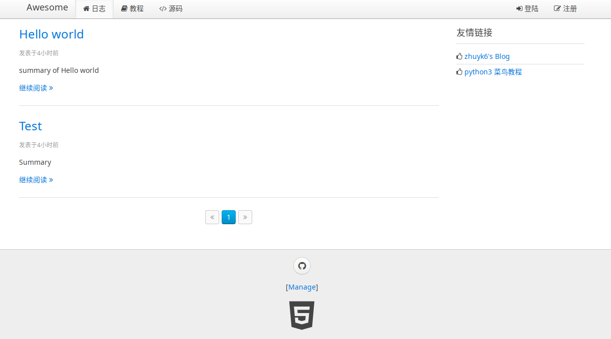
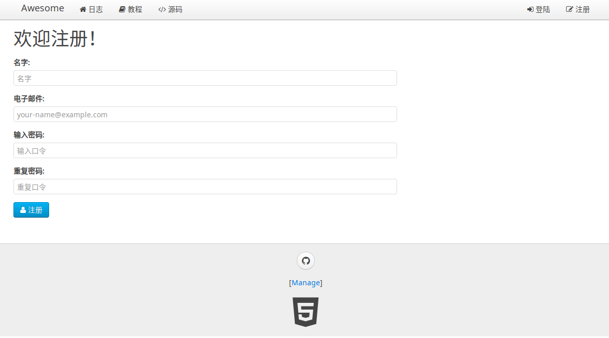
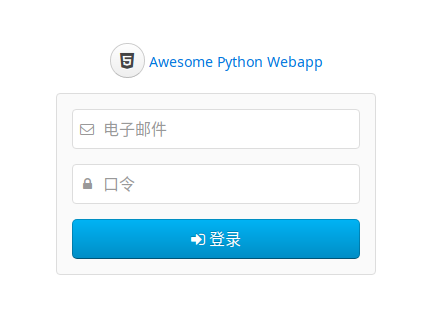
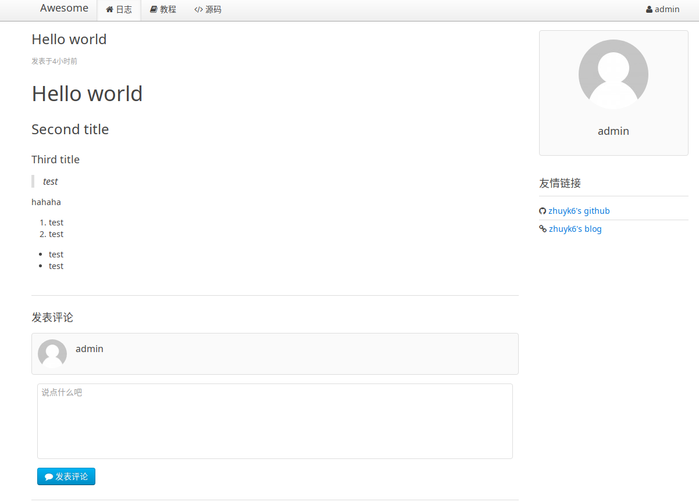
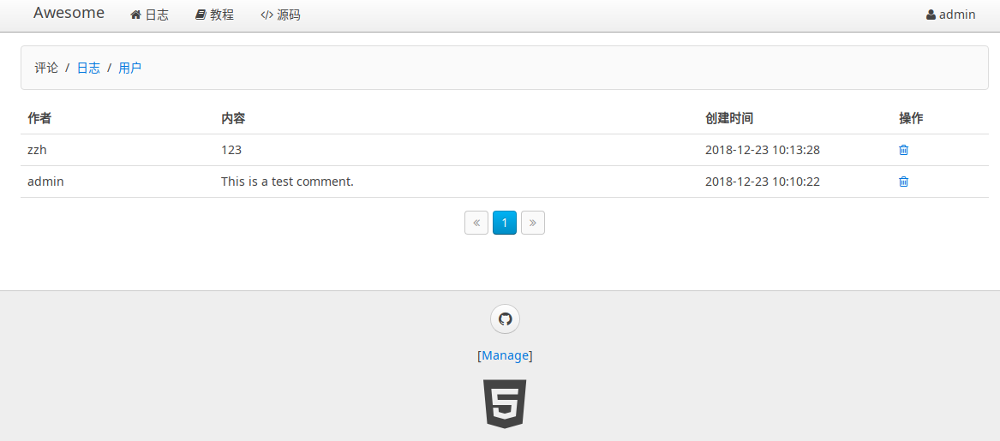
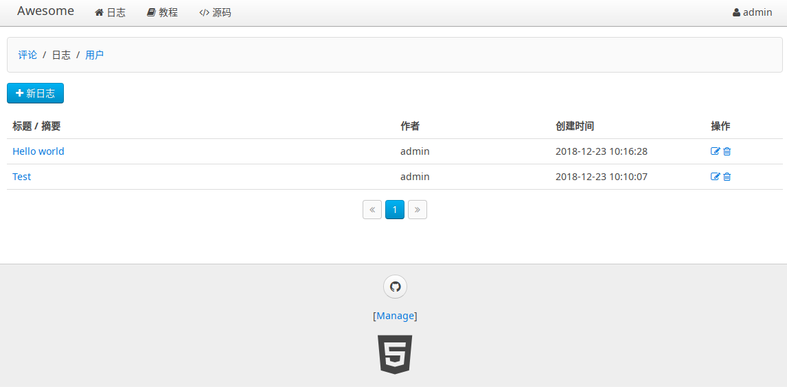
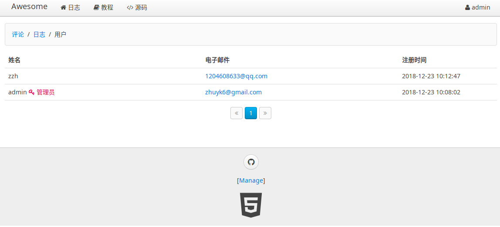
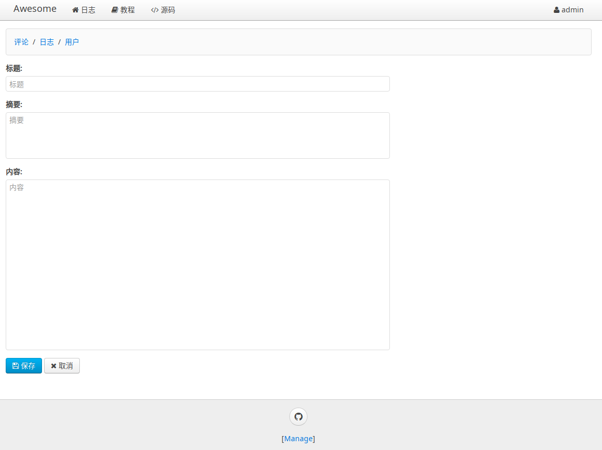

# 项目简介

该项目使用python语言以及一些基础的通信架构，实现了自己的web框架，并且搭建了一个简单博客网站。

# 项目结构

整个项目主要包括三个部分：

1. 基础架构
2. 后端`API`
3. 前端`html`页面

下面详细地对各个部分进行说明。

## 基础架构

由于考虑到大量页面访问的效率问题，所以使用的是异步IO机制，全部使用携程实现。

使用到了已有的`aiohttp`异步框架以及mysql的异步驱动程序`aiomysql`，在此基础上实现了自己的web框架。

### ORM

orm（Object Relational Mapping）对象关系映射是建立起python语言与mysql之间的对象的相互转换以及操作。

mysql数据类型在python中的抽象：

```python
class Field(object):
    def __init__(self, name, column_type, primary_key, default):
        self.name = name
        self.column_type = column_type
        self.primary_key = primary_key
        self.default = default

    def __str__(self):
        return "<%s, %s:%s>" % \
               (self.__class__.__name__, self.column_type, self.name)

class StringField(Field):
    def __init__(self, name=None, primary_key=False, default=None, ddl='varchar(100)'):
        super().__init__(name, ddl, primary_key, default)

... # 其他类型
```


数据库的基本操作抽象为`select`和`execute`:

```python
async def select(sql, args, size=None):
    log(sql, args)
    global __pool
    async with __pool.get() as conn:
        async with conn.cursor(aiomysql.DictCursor) as cur:
            await cur.execute(sql.replace('?', '%s'), args or ())
            if size:
                rs = await cur.fetchmany(size)
            else:
                rs = await cur.fetchall()
        logging.info("rows returned: %s" % len(rs))
        return rs

async def execute(sql, args, autocommit=True):
    log(sql, args)
    global __pool
    async with __pool.get() as conn:
        if not autocommit:
            await conn.begin()
        try:
            async with conn.cursor(aiomysql.DictCursor) as cur:
                await cur.execute(sql.replace('?', '%s'), args)
                affected = cur.rowcount
            if not autocommit:
                await conn.commit()
        except BaseException:
            if not autocommit:
                await conn.rollback()
            raise
        return affected
```


定义模型`Model`的元类`ModelMetaclass`：

```python
class ModelMetaclass(type):
    def __new__(cls, name, bases, attrs):
        if name == 'Model':
            return type.__new__(cls, name, bases, attrs)
        table_name = attrs.get('__table__', None) or name

        mappings = ... # 保存属性和列的映射关系
        fields = ... # 所有属性名
        primary_key = ... # 主键属性名
        escaped_fields = ... # 除主键外的属性名

        attrs['__mappings__'] = mappings    
        attrs['__table__'] = table_name
        attrs['__primary_key__'] = primary_key  
        attrs['__fields__'] = fields    

        attrs['__select__'] = 'select `%s`, %s from `%s`' % \
                              (primary_key,
                               ', '.join(escaped_fields),
                               table_name)
        ... # __delete__, __update__ 等等
        return type.__new__(cls, name, bases, attrs)
```


将mysql中的表格`table`映射为python中的`Model`，并且操作之间的映射如下：

- `select` $\rightarrow$ `find` or `findNumber`
- `insert` $\rightarrow$ `save`
- `update` $\rightarrow$ `update`
- `delete` $\rightarrow$ `remove`

```python
class Model(dict, metaclass=ModelMetaclass):
    def __init__(self, **kw):
        super(Model, self).__init__(**kw)
    
    @classmethod
    async def findAll(cls, where=None, args=None, **kw):
        """
        find all objects by where clause
        """
        sql = [cls.__select__]
        if where:
            sql.append("where")
            sql.append(where)
        rs = await select(" ".join(sql), args)
        return [cls(**r) for r in rs]
    
    async def save(self):
        args = list(map(self.getValueOrDefault, self.__fields__))
        args.append(self.getValueOrDefault(self.__primary_key__))
        rows = await execute(self.__insert__, args)
        if rows != 1:
            logging.warning("failed to insert record: affected rows: %s" % rows)

    ... # 其他操作：update, remove等等

```

### Web框架

由于已有的`aiohttp`框架过于底层，所以这里对它进行一定程度的封装。

原有的`aiohttp`需要进行以下几个步骤：

1. 编写使用`@asyncio.coroutine`修饰的函数

   ```python
   @asyncio.coroutine
   def handle_url_xxx(request):
       pass
   ```

2. 从`request`中获取所需要的参数

3. 构造`Response`对象

   ```python
   text = render('template', data)
   return web.Response(text.encode('utf-8'))
   ```

这样显得很麻烦，对它进行封装，封装的效果如下：

1. 处理带参数的URL `/blog/{id}`

   ```python
   @get('/blog/{id}')
   def get_blog(id):
       pass
   ```

2. 处理`query_string`参数通过关键字参数接受

   ```python
   @get('/api/comments')
   def api_get_users(*, page='1'):
       pass
   ```

3. 函数返回值不一定是`web.Response`，可以是`int`、`str`等其他对象

4. 需要渲染模板，可以通过返回一个`dict`实现

   ```python
   return {
       "__template__": "blog.html",
       "blog": blog,
       "comments": comments
   }
   ```

具体的封装方法，是通过实现一个`RequestHandler`类，来对URL处理函数进行封装，使其装换为一个返回`web.Response`的携程：

```python
class RequestHandler(object):
    def __init__(self, app, f):
        self._app = app
        self._func = f
        ...

    async def __call__(self, request):
        kw = ... # 获取参数

        ret = await self._func(**kw)
        return ret

```

注册一个URL处理函数：

```python
def add_route(app, f):
    method = getattr(f, "__method__", None)
    path = getattr(f, "__route__", None)
    if path is None or method is None:
        raise ValueError("@get or @post not defined in %s." % str(f))
    if not asyncio.iscoroutinefunction(f) and not inspect.isgenerator(f):
        f = asyncio.coroutine(f)
    logging.info("add route %s %s => %s(%s)" %
                 (method, path, f.__name__, ", ".join(inspect.signature(f).parameters.keys())))
    app.router.add_route(method, path, RequestHandler(app, f))

```

### Middleware中间件

middleware是一种拦截器，在URL被对应函数处理前后先进行加工处理，可以改变函数的输入、输出。本质上是位于前后端之间的一类函数。

例如：

- `logger_factory`：用于在URL处理函数工作前，打上log。

  ```python
  async def logger_factory(app, handler):
      async def logger(request):
          logging.info("Request: %s %s" % (request.method, request.path))
          return (await handler(request))
      return logger
  ```

- `response_factory`：用于URL处理函数工作后，将结果加工返回。

  ```python
  async def response_factory(app, handler):
      async def response(request):
          logging.info("Response handler...")
          ret = await handler(request)
          if isinstance(ret, web.StreamResponse):
              return ret
          if isinstance(ret, bytes):
              tmp = web.Response(body=ret)
              tmp.content_type = "application/octet-stream"
              return tmp
          ... # 返回值为其他类型
  
          tmp = web.Response(body=str(ret).encode("utf-8"))
          tmp.content_type = "text/plain;charset=utf-8"
          return tmp
      return response
  ```

## 后端API

后端API如下：

- 获取日志：`GET /api/blogs`
- 创建日志：`POST /api/blogs`
- 修改日志：`POST /api/blogs/{id}`
- 删除日志：`POST /api/blogs/{id}/delete`
- 获取评论：`GET /api/comments`
- 创建评论：`POST /api/blogs/{id}/comments`
- 删除评论：`POST /api/comments/{id}/delete`
- 创建用户：`POST /api/users`
- 获取用户：`GET /api/users`

## 前端页面

前端使用[uikit](https://getuikit.com/)框架，并且使用`jinja2`模板进行渲染。

前端页面如下：

- 首页：`GET /`

  

- 注册页：`GET /register`

  

- 登录页：`GET /signin`

  

- 日志详情页：`GET /blog/{id}`

  

- 评论管理页：`GET /manage/comments`

  

- 日志管理页：`GET /manage/blogs`

  

- 用户管理页：`GET /manage/users`

  

- 日志创建（修改）页：`GET /manage/blogs/create`

  

# 实验心得

1. 本次实验是我第一次写有关web的程序，学到了很多web的相关知识，例如：如何写前端html页面、javascript代码，如何使用css框架。
2. 加深了对于web的理解，了解到了前后端是如何结合在一起良好工作的。
3. 学会了书写携程代码，异步IO。
4. 学会了如何在python中使用数据库mysql。
5. 也学会了很多很多关于python语言的技巧：元类、修饰器、ducktype等等。

# 参考资料

[1] <https://www.liaoxuefeng.com/wiki/0014316089557264a6b348958f449949df42a6d3a2e542c000>

[2] <http://www.runoob.com/html/html-tutorial.html>

[3] <https://getuikit.com/docs/introduction>

[4] <https://cn.vuejs.org/index.html> 